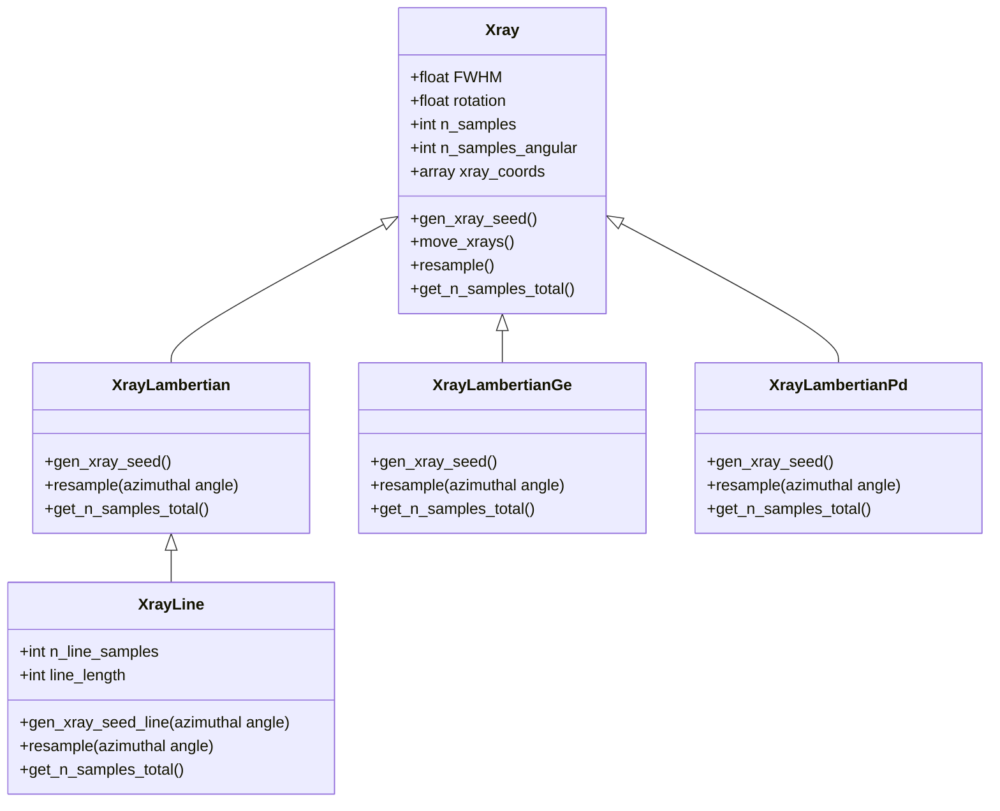
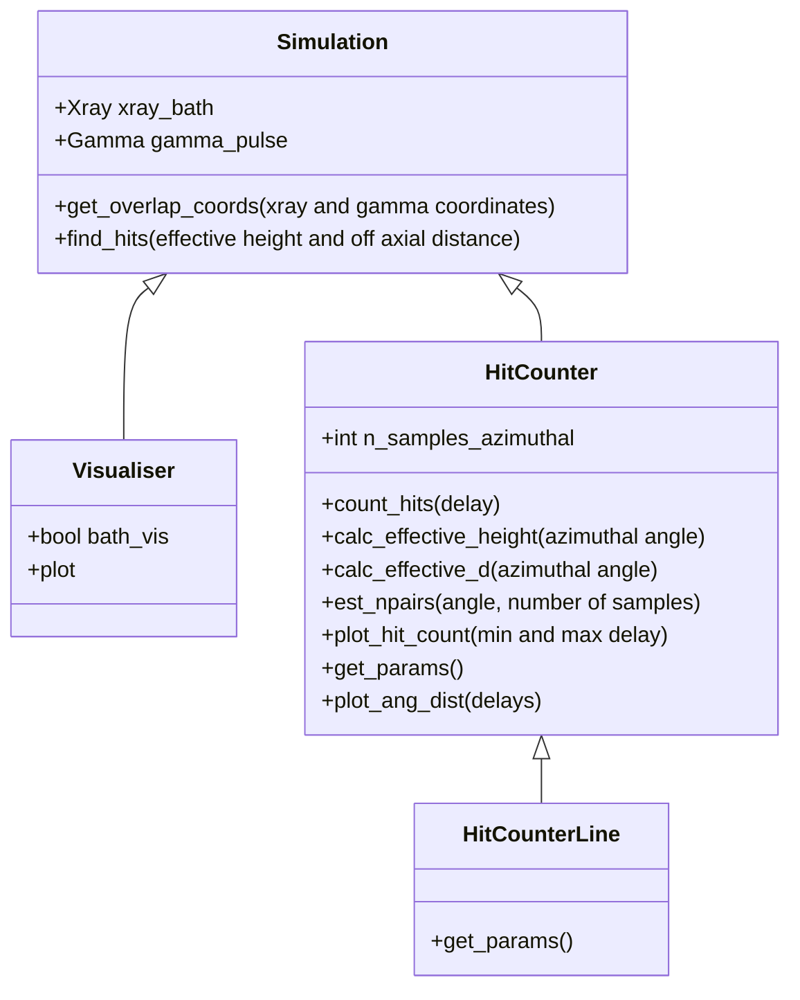
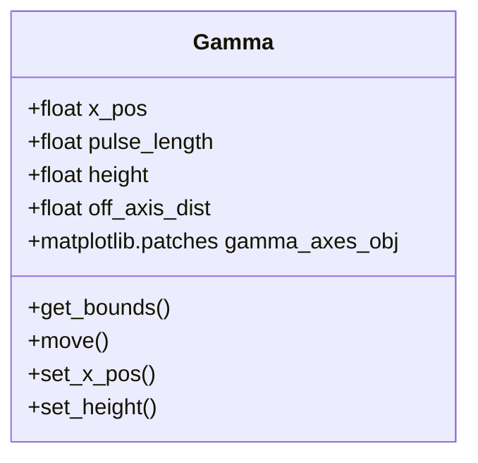

# MakingMatterfromLight2025

## Description
Simulates Gamma pulse and Xray bath collision geometry for the pair generation section of the Breit Wheeler laser-plasma platform experiment in [1]
using a Monte Carlo method.

## Installation
**Requirements: python3, pip3**
```bash
git clone https://github.com/genericaccountname15/MakingMatterfromLight2025.git
cd MakingMatterfromLight2025
python3 module_download.py
```

## Brief Module Descriptions
| Module name | Description |
| --- | ---------- |
| module_download | Script which downloads all required python modules using pip3 |
| spectral_data | Samples a probability density function based on the gamma and xray emmision spectra given in [1] (figures 3 and 4).|
| cross_section | Calculates Breit-Wheeler cross section using formula given by equation 3 of section 8 of [1] and checked with [2]. |
| values | Experimental parameters from experiment [1]. Data sourced from [3][4]. Also contains values of some scientific constants. |
| simulation | Defines Xray, Gamma, Simulation, and Visualiser objects |
| hit_counter | Defines the HitCounter object |
| simulation_lambertian | Defines the XrayLambertian object. Simulates an Xray distribution which follows a Lambertian distribution [5]. |
| simulation_linesource | Defines the XrayLine object. Simulates an Xray distribution originating from a line source |
| optimise_delay | Reads output .pickle files from multiple simulation runs and compiles relavent data into a .csv file |
| plot_optimised_data | Plots the .csv file |
| analysis4 | Attempt at an analytical model for the simulation |

## Directory and File descriptions
| Directory/file name | Description |
| --- | ----------|
| Final_simulation | Contains all files required for the simulation |
| .pbs | Job scripts |
| data_read | Contains the gamma and xray energy spectra |
| other folders | data from simulation runs |

## Simulation Outputs
When a simulation is run it will output the following:
- The raw simulation data, saved to a pickled python dict
- The simulation parameters (pulse dimensions, position etc.), saved to a .csv file

When a simulation is run using the run_data_collection function it will additionally output:
- How the chosen independent variable affects the positron yield, saved to a .csv file
- A plot of the results, saved to a .png file

### Simulation Raw Data
Simulation pickle file description \
Pickled object is a python dict
| key | value |
| --- | ----- |
| delay | pulse timing delay values used (ps) |
| hit_count | number of hits |
| Npos_CsI | estimated number of positrons incident on the CsI detector |
| Npos_CsI_err | error in estimated positrons |
| n_samples | number of 'Xray photons' sampled |


## Class Diagram







## References
1) B. Kettle , D. Hollatz, et al. 2021 A laser-plasma platform for photon-photon physics URL https://arxiv.org/pdf/2106.15170
2) Robbie Watt. Monte Carlo Modelling of QED Interactions in Laser-Plasma Experiments. PhD. ; 2021
3) Dominik Hollatz. Detection of Positrons from Breit-Wheeler Pair Formation. PhD. ; 2021
4) Cary Colgan. Laser-Plasma Interactions as Tools for Studying Processes in Quantum Electrodynamics. PhD ; 2022
5) Wikipedia. Lambert's Cosine Law. URL https://en.wikipedia.org/wiki/Lambert%27s_cosine_law


