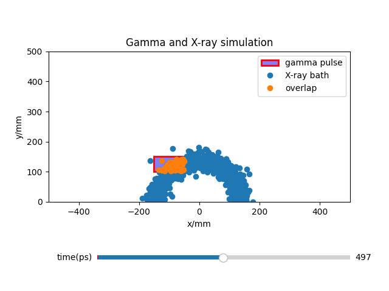

.. Monte Carlo BW Pair Production Simulation Documentation documentation master file, created by
   sphinx-quickstart on Fri Aug 15 17:57:20 2025.
   You can adapt this file completely to your liking, but it should at least
   contain the root `toctree` directive.

Monte Carlo BW Pair Production Simulation Documentation
========================================================
A Python package for simulating the number of electron-positron pairs produced
by a Breit-Wheeler [1]_ photon-photon collision using Monte Carlo techniques.

Background
----------
This package was developed as part of a UROP under Imperial College London's
Plasma Physics department. It aims to investigate the timing between the gamma pulse
and Xray emission, applied to the laser-plasma platform developed by B. Kettle et al. [2]_
And its effects towards electron-positron pair production. Specific values and formulae
from the experiment were obtained from [3]_ [4]_ [5]_ as well as members of the Imperial Plasma
Physics group.

Features
--------
- Monte Carlo Simulation engine
- Multiple Xray source models
   - Uniform
   - Lambertian
   - Lambertian-Germanium
   - Lambertian-Palladium
   - Line sources
   - Travelling-wave-ignited line sources
- Visualisation tools
- Analysis tools for post-processing

Quickstart Examples
-------------------
Scripts are written in main.py

How to run the simulation visualiser:

.. code-block:: python

   from core.gamma import Gamma
   from core.xray import Xray
   from visualisation.visualisation import Visualiser
   from data_collection.data_params import visual, quick

   xray = Xray(
      fwhm = visual['fwhm'],
      rotation = visual['rotation'],
      n_samples = quick['samples per angle'],
      n_samples_angular = quick['angle samples']
   )
   gamma = Gamma(
      x_pos = visual['x pos'],
      pulse_length = visual['pulse length'],
      height = visual['pulse height'],
      off_axis_dist = visual['off axis dist']
   )
   vis = Visualiser(
      xray_bath = xray,
      gamma_pulse = gamma,
      bath_vis = visual['bath vis']
   )
    vis.plot()

How to run a simulation to optimise setup angle:

.. code-block:: python

   import numpy as np
   from data_collection.data_collection import run_data_collection
   from data_collection.data_params import accurate, deep
   from theory import values

   run_data_collection(
      variables = np.linspace(0, 90, 10) * np.pi / 180,
      variable_name = 'angle',
      variable_parameter_name = 'rotation',
      units = 'radians',
      old_value = values.source_angle,
      xray_type = 'lambertian',
      repeat = 3,
      additional_label = '4Aug',
      sim_params = accurate,
      sample_params = deep
      )

Acknowlegements
---------------
First and foremost, I would like to thank my supervisor Stuart for 
supporting me throughout this UROP. I would also like to thank Steven,
Brendan, and Lawrence for  providing me with their advice, detailed diagrams,
and datasets from experiments. Lastly, I would like to thank the staff of Imperial
Plasma Physics, without whom none of this would be possible.

References
----------
.. [1] G. Breit & J.A. Wheeler 1934. *Collision of Two Light Quanta*. Phys. Rev. 46, 1087
.. [2] B. Kettle et al. 2021. *A laser–plasma platform for photon–photon physics* New J. Phys. 23 115006
.. [3] D. Hollatz 2021. *Detection of Positrons from Breit-Wheeler Pair Formation* PhD thesis. Friedrich Schiller University Jena.
.. [4] C. Colgan 2022. *Laser-Plasma Interactions as Tools for Studying Processes in Quantum Electrodynamics*. PhD thesis. Imperial College London.
.. [5] R. Watt 2021. *Monte Carlo Modelling of QED Interactions in Laser-Plasma Experiments*. PhD thesis. Imperial College London.

.. toctree::
   :maxdepth: 2
   :caption: Contents:

   core
   visualisation
   theory
   analysis
   data_analysis
   data_collection

Indices and tables
==================

* :ref:`genindex`
* :ref:`modindex`
* :ref:`search`
